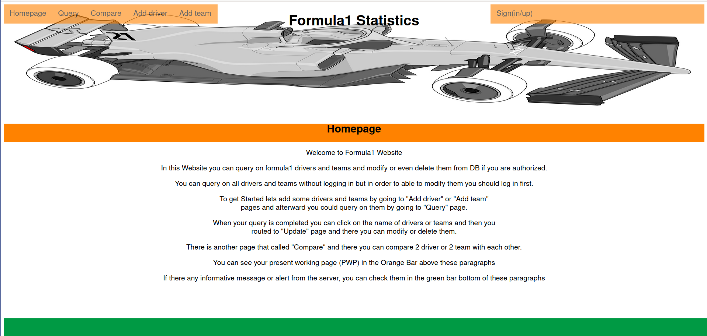

# About
 A database that will store and display data about Formula 1 using Google Cloud Platform  
As its primary storage database.  
  
# How To run
 To run the server you first need to create Google Cloud Platform account and save your identification    
into enviornment variable of your shell and install packages listed in requirements.txt and finally run the server:  
    
```    
python main.py
```  
    
# Sample Front Page     


